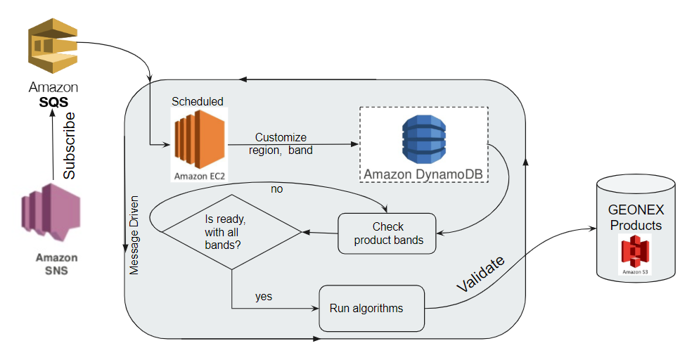
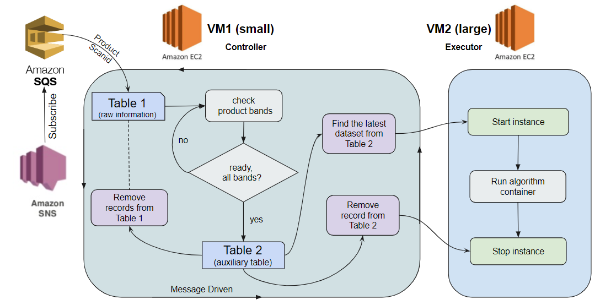

# Deploy GeoNEX

GeoNEX consists of 2 main parts:

1. GeoNEX service 
2. GeoNEX product

GeoNEX service allows users to run and monitor their docker Images in real-time through a graphical user interface while seamlessly ingesting remote sensing data from any source including GeoNEX products.
GeoNEX product is the platform that generates GeoNEX products and make them available for users such as:

 	1. geonex/active_fire_go16abi15
 	2. geonex/land_surface_temperature_go16abi15
 	3. geonex/surface_reflectance_hm08ahi12
 	4. geonex/surface_solar_radiation_hm08ahi16
 	5. geonex/top_of_atmosphere_hm08ahi05

More details about the products can be found here.

### Pre-requisites
##### Creating Access ID - Secret Access Key
Before you get start, you need to create following information: AWS Access Key ID and AWS Secret Access Key. For more details, refer to [here](https://aws.amazon.com/premiumsupport/knowledge-center/create-access-key/)

1. Go to [www.aws.amazon.com](www.aws.amazon.com)
2. Click on the upper right “Sign In to the Console” button
3. Enter your account ID, your IAM user name and your password. If you don’t have one, create one first here.
	* One AWS account can have multiple IAM users (including yourself). So create one for yourself with adequate permissions.
4. In the Find Services search box, enter “IAM” and click Enter
5. In the left menu, click “Users”
6. Click the desired user
7. Under “Security Credentials” tab, click on “Create Access Key” button
	* A window will pop out showing the “Access key ID” and “Secret Access Key”
8. Click the “Show” link to view the “Secret Access Key”
9. Save the pair in a secure location
	* ATTENTION: After the window is closed, you can never retrieve the same “Secret Access Key”

##### Granting IAM user EC2 permissions
1. login to the admin account  [www.aws.amazon.com](www.aws.amazon.com)
2. In the Find Services search box, enter “IAM” and click Enter
3. In the left menu, click “Users”
4. Click the desired user
5. Click the "add permissions" button
6. Select the 3rd "Attach existing policies directly"
7. Find the policy "AmazonEC2FullAccess"
8. Click "Next:Review" button
9. Click "Add permissions"
10. TODO: Add permissions for desired ports

##### Launching EC2 via AWS Management Console (browser)
You can launched the EC2 instance using AWS console by following this [user guide](https://docs.aws.amazon.com/AWSEC2/latest/UserGuide/concepts.html).

1. Make sure you are signed up for AWS account, have a IAM id and a key-value access pair
2. After you login to the console at  [www.aws.amazon.com](www.aws.amazon.com), click on EC2
3. Click on “Launch EC2 Instance” button then select desired image
	* A collection of existing OS images with different pre-installed packages is displayed as a list
	* select **Amazon Linux AMI 2018.03.0 (HVM), SSD Volume Type - ami-0ec6517f6edbf8044**
	*  specify type as **t2.xlarge**  (for deployment, will currently give a launch failure), **t2.micro** (for testing)
	* click "Launch"
	* it will prompt you to select a key-pair (for ssh), in case you did not create one before, click create new key-pair
	* give it a name KEY_NAME and click "Download Key Pair"
	* secure it by giving yourself only access
		* with the command line "chmod 400 KEY_NAME.pem" 
		* in Windows right click on /path/my-key-pair.pem and give yourself only read access 
			* Properties -> Security -> Advanced -> Permissions
	* click "Launch"
		* Failure in initiating
	* to circumvent the failure, change the type of the instance to t1.micro

##### Launching through AWS Command Line Interface (CLI local)
You can also launch EC2 instance using command line, follow [here](https://docs.aws.amazon.com/cli/latest/reference/ec2/).
To install AWS CLI, first make sure you have python installed. Use “pip” or “pip3” to install it, or download the MSI file for windows [here](https://s3.amazonaws.com/aws-cli/AWSCLI64PY3.msi):

1. Double click on the downloaded AWSCLI64PY3.msi to install it on Windows OS.
2. `pip3 install awscli --upgrade --user`

	* example: launching an ec2 instance:
`aws ec2 create-launch-template --launch-template-name TemplateForWebServer --version-description WebVersion1 --launch-template-data '{"NetworkInterfaces":[{"AssociatePublicIpAddress":true,"DeviceIndex":0,"Ipv6AddressCount":1,"SubnetId":"subnet-7b16de0c"}],"ImageId":"ami-8c1be5f6","InstanceType":"t2.small","TagSpecifications":[{"ResourceType":"instance","Tags":[{"Key":"Name","Value":"webserver"}]}]}'`
	* example: copying from your computer to AWS S3 directory:
`aws s3 cp myvideo.mp4 s3://mybucket/`
	* example: chekcing AWS configuration
`aws configure`

##### Accessing EC2 instance through SSH
For more details visit [here](https://docs.aws.amazon.com/AWSEC2/latest/UserGuide/AccessingInstancesLinux.html) Make sure your computer has the ssh client installed.

1. Get the id of the EC2 instance (from instance ID column or through AWS CLI command “describe-instances”
2. Get the public DNS name of instance (same as 1.)
3. Get IPv6 of the EC2 instance (same as 1.)
4. Locate instance permission key (.pem) on your computer (0400 access mod)
	* chmod 400 /path/my-key-pair.pem
	* in Windows right click on /path/my-key-pair.pem and give yourself only read access
5. Get default name of AMI used to launch instance (ex: ec2-user, centos…)
6. Enable ssh traffic for your instance, visit [here](https://docs.aws.amazon.com/AWSEC2/latest/UserGuide/authorizing-access-to-an-instance.html).
	* Accessing instance terminal:
	`ssh -i /path/my-key-pair.pem ec2-user@ec2-198-51-100-1.compute-1.amazonaws.com`
	* Transferring files from local to EC2:
	`scp -i /path/my-key-pair.pem /path/SampleFile.txt ec2-user@ec2-198-51-100-1.compute-1.amazonaws.com
`
	* Transferring files from ec2 instance to local
	`scp -i /path/my-key-pair.pem ec2-user@ec2-198-51-100-1.compute-1.amazonaws.com:~/SampleFile.txt ~/SampleFile2.txt
`
---

### Deploying GeoNEX service on AWS
GeoNEX consists of 3 main docker containers runnning on 1 AWS EC2 instance:

* geonex-db
* geonex-core
* geonex-dash

1. Launch EC2 instance (check part I)
2. Install mySQL
	* `sudo yum install mysql-server`
	If above fails, you likely did not choose the correct Amazon Linux Image.
3. Install docker
	* `sudo yum install docker`
	* `sudo service docker stop`
	* Add the ec2-user (or $USER) to the docker group so you can execute Docker commands without using sudo. Note that you’ll have to log out and log back in for the settings to take effect:
	* `sudo usermod -a -G docker $USER`
	* `sudo reboot`
	* `sudo service docker start`
4. Running geonex-db Image
	* Pull geonex-db Image from repo or alternatively build from source:
	* `sudo yum install git-core`
	* `git clone https://gitlab.nautilus.optiputer.net/geonex/geonex-db.git`
	* `cd geonex-db`
	* `make build`
	* `sudo service mysqld stop`
    * Choose mySQL password and store in: MYSQL_ROOT_PASSWORD
	* `export MYSQL_ROOT_PASSWORD=${MYSQL_ROOT_PASSWORD}`
	* `export MYSQL_ROOT_PASSWORD=EXAMPLE`
	* verify port being used by docker
	* `sudo netstat -pna | grep 3306`
	* `make it`
	* `docker ps -a` 
		* should show status “Up ..”
	* `make test`
	* access the geonex-db container terminal: `docker exec -it geonex-db /bin/bash`
	* login to the mysql DB: mysql -uroot -p`
	* `ALTER USER 'root'@'%' IDENTIFIED WITH mysql_native_password BY 'MYSQL_ROOT_PASSWORD';`
	* `ALTER USER 'root'@'localhost' IDENTIFIED WITH mysql_native_password BY 'MYSQL_ROOT_PASSWORD';`
	* exit mysql DB `exit`
	* exit geonex-db container `exit`
	* login again from main instance: `mysql -uroot -p -h 0.0.0.0 -P 3306`
	* `create database geonexdb`
	* `use geonexdb`
	* `source ~/geonex-db/sql-scripts/CreateTables.sql`
	* `source ~/geonex-db/sql-scripts/InsertData.sql`
	* make sure scripts were correctly executed by checking mysql tables:
	`select * from user;` and `select * from image`. make sure more than 1 record (rows) are available in the image table.
if not, execute them line by line by copy pasting on mysql and clicking enter for each


5. Running geonex-core Image
	* make sure you are inside ec2 instance with geonex-db 
	* `git clone https://gitlab.nautilus.optiputer.net/geonex/geonex-core.git`
	* edit config.json to have the following:
	```
	{
    "dbhost": "YOUR-EC2-INSTANCE-DNS",
    "dbuser": "root",
    "dbpassword": " YOUR-MYSQL-PASSWORD",
    "dbname": "geonexdb",
    "securitygroup": "YOUR-SECURITY-GROUP-NAME",
    "keyfilename" :"YOUR-KEY-PAIR-NAME",
    "s3bucket" : "YOUR-BUCKET-NAME",
    "s3ouput": "YOUR-BUCKET-OUTPUT-PATH"
   }
   ```
   	* export env variables with your own AWS_ACCESS_KEY_ID/AWS_SECRET_ACCESS_KEY:
   	* `export  AWS_ACCESS_KEY_ID=${AWS_ACCESS_KEY_ID}` 
	* `export  AWS_SECRET_ACCESS_KEY=${AWS_SECRET_ACCESS_KEY}`
	* `export  AWS_DEFAULT_REGION=us-west-1`
	* `cd geonex-core`
	* `make build`
	* `make it`
	* make sure you logout from session so that env variables get reset

6. Running geonex-dash Image
	* make sure you are inside ec2 instance
	* make sure GeoNEX-db container is running
	* `git clone https://gitlab.nautilus.optiputer.net/geonex/geonex-dash.git`
	* edit config.json by modifying the following:
	~~~~
	{
    "dbhost": "YOUR-EC2-INSTANCE-DNS",
    "dbuser": "root",
    "dbpassword": " YOUR-MYSQL-PASSWORD",
    "dbname": "geonexdb",
   	}
	~~~~
	* `cd geonex-dash`
	* `make build`
	* `make it`
	* dashboard should be accessible at:
		YOUR_INSTANCE_IP:8080/, if not modify allowed ports in security group
---

### Deploying GeoNEX product on AWS
#### Single Instance
GeoNEX product is the system that seamlessly ingests Satellite imagery and produces the GeoNEX products listed here. It currently runs on one EC2 real-time runner instance. The system:

1. subscribes to GOES-16 and GOES-17 datasets notifications
2. collects the data into Amazon dynamodb datastructure through filtering region, type and band.
3. checks whether the datasets are ready for processing
4. runs the algorithms which will download all required datasets and produce the final output and store it on Amazon S3 databucket.

The entire workflow can be deployed on one EC2 instance using one AWS account, and is visualized in the diagram below:


#### Advanced Instance
One disadvantage of the Single Instance design is low efficiency of resource usage, since a large EC2 instance must be operating continuously.
A better alternative would be to use a micro EC2 instance to monitor the official GOES-16 and GOES-17 data notification stream, and once new data is available, launch a new large instance to execute the GEONEX algorithms with latest GOES scans. The smaller instance would thus consist of a controller, which is responsible for monitoring, collecting the topics into amazon dynamodb after filtering region, type, and band, then check whether the dataset is ready for processing, also control another EC2 instance, such as start, and stop.  The small instance would be continously running. The larger instance, named executor, is only responsible for running the algorithms after downloading required datasets and generating the final products into Amazon S3, and is initiated and terminated by the controller instance thus saving on resources.
The diagram for the design is shown in the figure below.


## Appendix

### Build GeoNEX doc on readthedocs

So far the GeoNEX doc is hosted on [here](https://github.com/suredream/geonex-doc) as a public repository, building seamlessly after commits on readthedocs and accessible at:

[https://geonex.readthedocs.io/en/latest/](https://geonex.readthedocs.io/en/latest/).

To setup the above continuous integration mechanism, follow these steps:

1. Create a ReadTheDocs account
	* Sign up to ReadTheDocs: <https://readthedocs.org/accounts/signup/>

	* Verify email address


2. Link to Github account

	* Make sure you are on the main page of ReadTheDocs
	* Click on "Import a Project" button
	* If you were not previously connected, Click on "Connect to GitHub" button (note: it works with gitlab as well)
​	* Otherwise, Click on "Authorize readthedocs"
​	* Your repos will appear as a list

3. Adding a Github repo 
	* Make sure you are on the main page of ReadTheDocs
	* Click on + sign of the repo you want to add
	* in Name field, enter the project name you want, ex: geonex. Note that this will automatically be part of your base URL - ATTENTION: this is irreversible, choose name carefully
	* click Next
	* click Admin tab
	* select "mkdocs" instead of default "sphinx" in Documentation type
	* click Save
	* you will get: build failed -> reason: unrecognized configuration "nav". It turns out Read The Docs uses an old version of mkdocs

4. Fixing old version of mkdocs issue
	* Make sure you are on the main page of ReadTheDocs, under desired project.
	* click Admin
	* click Advanced Settings
	* in requirements file, add the entry "requirements.txt".
	* create a requirements.txt file in your github home directory with the following content:
		* mkdocs==1.0.4 
	* click Save (this should resolve the build issue)
	* After few minutes, visit the URL <https://geonex.readthedocs.io/en/latest/>

​	


