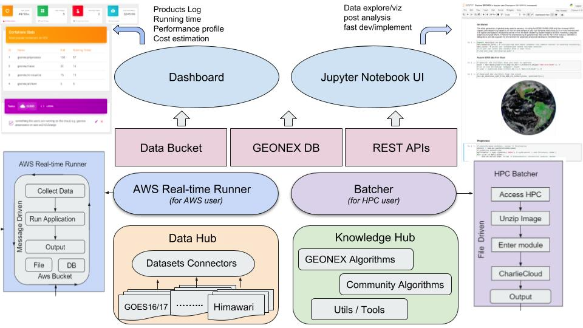

### How GeoNEX works?
GeoNEX is a computational service incorporating one or more standard dockerized algorithms that interact with data buckets for storage. The service houses a large repository of publicly available geostationary datasets and GeoNEX products. Users can access and analyze data from the public catalog using GeoNEX containers as well as their own analysis algorithms once dockerized. In addition, users can leverage their work to powerful features provided by GeoNEX, including real-time analytics, standard preprocessing and visualization, etc. (example: cloud detection). The flow diagram below shows a global view of GeoNEX, its capabilities and interfaces.

*GeoNEX overview flow diagram*. 

The diagram describes the interactions between the different modules of the platform. The AWS Real-time Runner and Batcher are the core processing modules on the cloud side and the local side respectively. Both modules collect data, run an analysis pipeline and save their outputs to a data bucket (cloud) or a file system (local). Access to the processing modules is mediated through two main interfaces: The Dashboard which provides real-time usage statistics, cost estimation, logs and controls of all running processes to the end-user. The user can also conveniently access the processing modules through python libraries via Jupyter Notebook UI.

### Which sensors are supported?

GeoNEX aims to support the land monitoring capabilities of new generation geostationary platforms, which include:

- ABI – Advanced Baseline Imager on GOES-R/T
- AHI – Advanced Himawari Imager on Himawari
- AMI – Advanced Meteorological Imager on GEO-KOMPSAT2
- FCI – Flexible Combined Imager on MTG
- AGRI – Advanced Geosynchronous Radiation Imager on Fengyun-4

### What products are provided?

GEONEX allows access to the products shown in the table below at the specified resolution.

### What are the relationships between NEX, GeoNEX and OpenNEX?

NASA Earth eXchange (NEX) is a collaborative supercomputing and data analytics platform that aims to improve the availability of Earth science data from NASA missions and other sources, models, analysis tools and research results through a centralized environment that fosters knowledge sharing, collaboration, and innovation.

GeoNEX [(https://geonex.org)](https://geonex.org) is a web-based scientific platform for the earth science community to analyze the new generation Geostationary (GEO) datasets. For more details go to [How GeoNEX works?](#how-geonex-works)

[OpenNEX](https://opennex.org:9033/opennex) is the knowledge discovery portal of NEX. For detailed documentation go to
<a href="http://hawking.sv.cmu.edu:9039/!opennex/doku.php?id=appstore:register_api" target="_blank">OpenNEX Documentation</a>.

Both the research community and the public can access GeoNEX and OpenNEX platforms.
OpenNEX has video tutorials on how to create and publish dockerized images and APIs and is well documented. Users can use both other users' or NEX sponsored images and algorithms. Similarly, GeoNEX allows for the use, publishing and visualization of real-time analytics on seamless satellite inputs. GitLab holds the collection of algorithms' source code. Docker makes it easier to create, deploy, and run the algorithms and applications by using containers. Containers (image) allow a developer to package up an application with all of the parts it needs, such as libraries and other dependencies, and ship it all out as one package. All cloud based processing and storage are provided by Amazon Web Services as EC2 instances for processing and S3 data buckets for storage. Local processing and storage are handled by Singularity.

The work is a collaboration between NEX, NOAA, NASA, Carnegie Mellon University, Cal State Monterey Bay, Chiba University, Jaxa and NICT.

### Contact Us 
Are you a scientist? Do you want to collaborate?
For potential collaboration, contact the GeoNEX team at <geonex84@gmail.com> and receive an account.