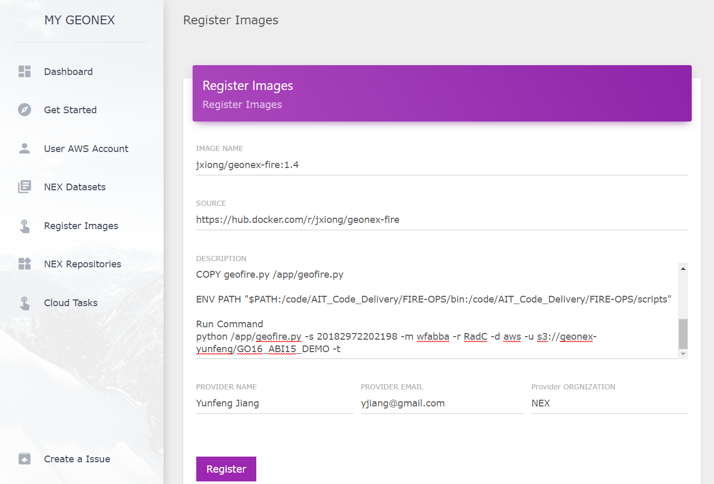
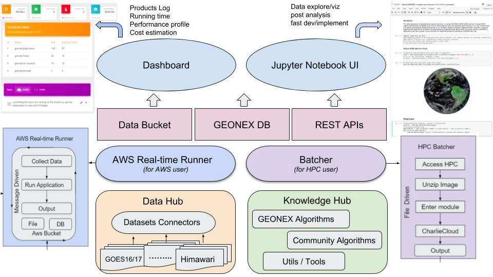
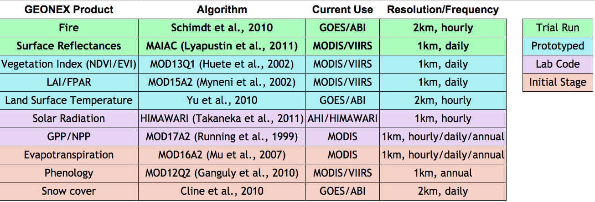

# Welcome to GeoNEX

This is a collection of documentation for GeoNEX users.

## Get Started 

### How to register docker image?

The docker image could come from one public docker hub, where user can directly download it without any permissions. User have to put image’s source, description, user name, email, and user’s organization  when registering your image. Once you register the image, the image can be found in NEX Repositories like below:

For each image, user can execute “Run” action. If the image has not been downloaded in current running instances, INSTANCE label will show as “null”. User can select the instance type they would like, customize the command line to run, and output like Amazon S3 bucket.

Once running docker image, user can find the launched tasks in Cloud Task list, each task display some details include image names, instance type, status, launched time, command, and instance id.

## Policies

## Best Practices

## Frequently Asked Questions

### How did GEONEX works?

GEONEX consists of  data buckets co-located with a group of standard dockerized algorithms as computation service. The datasets houses a large repository of publicly available geostationary datasets as well as GEONEX products. Users can access and analyze data from the public catalog using geonex containers as  as well as their own analysis once dockerized. Also users can leverage their work to powerful features provided by GEONEX, including real-time analytics, standard preprocessing, cloud detection, visualization, etc.

### Which sensors supported?

We aim to support the land monitoring capabilities of new generation geostationary platforms, includes:

- ABI – Advanced Baseline Imager on GOES-R/T
- AHI – Advanced Himawari Imager on Himawari
- AMI – Advanced Meteorological Imager on GEO-KOMPSAT2
- FCI – Flexible Combined Imager on MTG
- AGRI – Advanced Geosynchronous Radiation Imager on Fengyun-4

### What products in plan?

