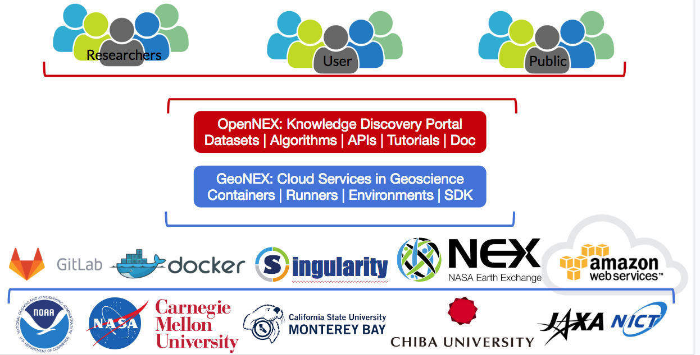

# Welcome to GeoNEX

A collection of documentation for GeoNEX users.

This GeoNEX project aims to address key challenges of data-driven geostationary satellite research, including but are not limited to, access to sufficient computing resources, massive data transfer, standardized analysis workflows and reproducibility to communicate analyses so that they can be reused and extended. 

*Before you get started, you might want to check out* [*our project slides*](https://docs.google.com/presentation/d/1tOD7abmvFd7bYaLMkiPnmYsRvU7VTu9qaGQul6sbh3k/edit?usp=sharing)*.*

This documentation includes both guidelines, examples and source code docs.

The documentation is accessible at [https://geonex.readthedocs.io](https://geonex.readthedocs.io)

# Concepts in GeoNEX

About the word “IMAGE" and “Container”: Note that we avoid the use of the word **IMAGE** as it is way too vague and it is heavily overloaded, and also easily confused with the **Remote-Sensed Data Products** from satellite or **Imagery-based Map.** In GeoNEX, we use the word "image" to denote very different types of data and data products. We want to evangelize a new way to talk about algorithms/softwares/services running on GeoNEX.

- GEONEX Account** - An AWS account, you need to create it to get access to GEONEX resources, including algorithms, runners, tasks, AWS instances and buckets.
- Buckets - AWS S3 buckets, used as input and output storage of GEONEX products. The geonex algorithm pools has different algorithms based on GEONEX datasets. The dataset category enables to display the latest ready datasets for downloading or used by scientists. NOAA GOES-16 and GOES-17 have been trackable real-time and Himawari8 is semi real-time.
- Repos - a dockerized algorithm, within it a combination of a file system and GEO application was built. It can be hosted on public docker registry services ([hub.docker](https://hub.docker.com/); [AWS ECR](https://aws.amazon.com/ecr/); [gcr.io](https://cloud.google.com/container-registry/))
- Containers - a standard unit on GEONEX approved by the administrator to finish specific processing/analysis jobs. User enable to see all running, stopped, or finished tasks in the dashboard. Some user with permission also can view products from the specific tasks, and check log files for each task. These tasks are automatically executed at the back-end using EC2 instances. User can also customize the instances with different  types and sizes for running each container.
- Tasks - the runtime instance of a GEONEX containers.
- Workspace  - containers related to specific output buckets, which can be browsed in the viewer

# Policies

After registering their images, guest user opens GEONEX Images tab, and clicks “ Request” button. The dashboard will automatically send an email notification to system administrator, and let him/her know there is one image need him/her approve. Administrator logins the dashboard and clicks “Approve” button, then finish the approval. 

## AWS EC2 instance

## Policies

## Best Practices

### 

## Frequently Asked Questions

### How did GEONEX works?

GEONEX consists of  data buckets co-located with a group of standard dockerized algorithms as computation service. The datasets houses a large repository of publicly available geostationary datasets as well as GEONEX products. Users can access and analyze data from the public catalog using geonex containers as  as well as their own analysis once dockerized. Also users can leverage their work to powerful features provided by GEONEX, including real-time analytics, standard preprocessing, cloud detection, visualization, etc.

### Which sensors supported?

We aim to support the land monitoring capabilities of new generation geostationary platforms, includes:

- ABI – Advanced Baseline Imager on GOES-R/T
- AHI – Advanced Himawari Imager on Himawari
- AMI – Advanced Meteorological Imager on GEO-KOMPSAT2
- FCI – Flexible Combined Imager on MTG
- AGRI – Advanced Geosynchronous Radiation Imager on Fengyun-4

### What products in plan?

### What are the relationships between NEX, GeoNEX and OpenNEX?

NASA Earth eXchange (NEX), a collaborative supercomputing and data analytics platform, improves the availability of Earth science data from NASA missions and other sources, models, analysis tools and research results through a centralized environment that fosters knowledge sharing, collaboration, and innovation.

GEONEX (https://geonex.org) is a web-based scientific platform for earth science community to analyze the new generation of Geostationary (GEO) datasets.

OpenNEX is the knowledge discovery portal of NEX.

