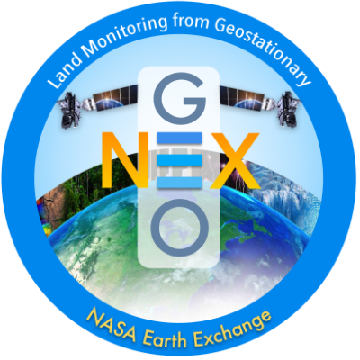
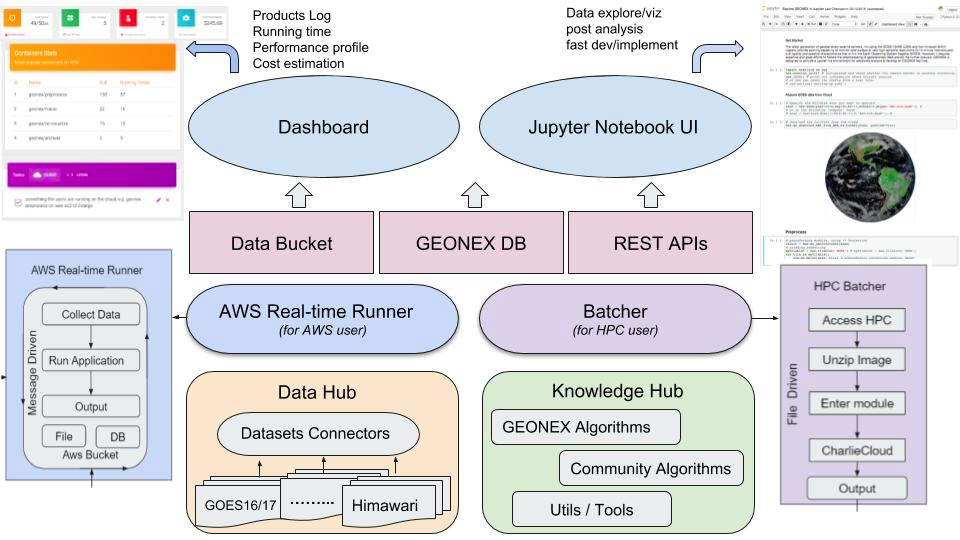

# Welcome to GeoNEX

A collection of documentation for GeoNEX users.

This GeoNEX project aims to address key challenges of data-driven geostationary satellite research, including but are not limited to, access to sufficient computing resources, massive data transfer, standardized analysis workflows and reproducibility to communicate analyses so that they can be reused and extended. 

*Before you get started, you might want to check out* [*our project slides*](https://docs.google.com/presentation/d/1tOD7abmvFd7bYaLMkiPnmYsRvU7VTu9qaGQul6sbh3k/edit?usp=sharing)*.*

This documentation includes both guidelines, examples and source code docs.

The documentation is accessible at [https://geonex.readthedocs.io](https://geonex.readthedocs.io)

## GeoNEX Architecture

A simplified system architecture diagram is shown below. 

Geostationary Satellite Images (GOES16/17, Himawari) are hosted on Cloud-based storage (AWS S3 buckets); specific algorithms were registered on Knowledge Hub and hosted on various docker registery services. The batch system includes two sub-parts: AWS Real-time Runner and HPC batcher, which manage computation distribution among a pool of Compute Servers, and launch algorithms container when rules were met. Outputs buckets, GeoNEX database and restful APIs were deployed on top of them to support another two web application: Dashboard and Notebook. The former application is a console to help users to access resources and tasks of GeoNEX, while the latter is a R & D environment for fast-prototype, exploration and education purposes.

Users can access and analyze data from the public catalog using GeoNEX containers as  as well as their own analysis once dockerized. Also users can leverage their work to powerful features provided by GEONEX, including real-time analytics, standard preprocessing, cloud detection, visualization, etc.

### GeoNEX Website

[GeoNEX Website](https://www.geonex.org/)

### GeoNEX Data Hub

### GeoNEX Knowledge Hub

### AWS Real-time Runner

### HPC Batch System

### GeoNEX Dashboard @ YF

### Notebook

## GeoNEX Glossary

NOTICE**: About the word “IMAGE" and “Container”: Note that we avoid the use of the word **IMAGE** as it is way too vague and it is heavily overloaded, and also easily confused with the **Remote-Sensed Data Products** from satellite or **Imagery-based Map.** In GeoNEX, we use the word "image" to denote very different types of data and data products. We want to evangelize a new way to talk about algorithms/softwares/services running on GeoNEX.

For terms/items from Amazon/AWS not mentioned in this glossary, please refer to the [AWS Glossary](https://docs.aws.amazon.com/general/latest/gr/glos-chap.html).

### Pipeline (GeoNEX)

A dockerized algorithm, within it a combination of a file system and GEO application was built. It can be hosted on public docker registry services ([hub.docker](https://hub.docker.com/); [AWS ECR](https://aws.amazon.com/ecr/); [gcr.io](https://cloud.google.com/container-registry/))

### Task (GeoNEX)

Tasks - the runtime instance of a GEONEX pipeline. a standard unit on GeoNEX approved by the administrator to finish specific processing/analysis jobs. User enable to see all running, stopped, or finished tasks in the dashboard. Some user with permission also can view products from the specific tasks, and check log files for each task. These tasks are automatically executed at the back-end using EC2 instances. User can also customize the instances with different  types and sizes for running each container.

### Runner (GeoNEX)

Related to specific output buckets, which can be browsed in the viewer.

### Account (GeoNEX)

You need to create it to get access to GEONEX resources, including algorithms, runners, tasks, AWS instances and buckets.

### Administrator (GeoNEX)

Refers to those tasked with monitoring, configuring or otherwise utilizing GeoNEX in an operational deployment.

### AWS Access Keys

Access credentials that give you access to AWS to act as a IAM user programatically or from the command line. For more information, see the [AWS IAM Documentation](https://docs.aws.amazon.com/IAM/latest/UserGuide/id_credentials_access-keys.html).

### Bucket

An Amazon S3 cloud storage resource. For more information, see the [AWS Bucket Documentation](https://docs.aws.amazon.com/AmazonS3/latest/dev/UsingBucket.html).

The GeoNEX algorithm pool enables to display the latest ready datasets for downloading or used by scientists. NOAA GOES-16 and GOES-17 have been trackable real-time and Himawari8 is semi real-time.

### Cloudwatch

AWS service that allows logging and metrics collections on various cloud resources you have in AWS.

For more information, see the [AWS User Guide](https://docs.aws.amazon.com/AmazonCloudWatch/latest/monitoring/WhatIsCloudWatch.html).

### Common Metadata Repository (CMR)

"A high-performance, high-quality, continuously evolving metadata system that catalogs Earth Science data and associated service metadata records". For more information, see [NASA's CMR page](https://cmr.earthdata.nasa.gov/).

### Distributed Active Archive Center (DAAC)

Refers to a specific organization that's part of NASA's distributed system of archive centers. For more information see [EOSDIS's DAAC page](https://earthdata.nasa.gov/about/daacs)

### ECS

Amazon's Elastic Container Service. For more information, see [AWS's developer guide](https://docs.aws.amazon.com/AmazonECS/latest/developerguide/Welcome.html).

### Execution (GeoNEX)

A GeoNEX execution refers to a single execution of a (GeoNEX) Pipeline.

### GIBS

[Global Imagery Browse Services](https://earthdata.nasa.gov/about/science-system-description/eosdis-components/global-imagery-browse-services-gibs) provides quick access to over 800 satellite imagery products, covering every part of the world.  Through responsive and highly available web services, it enables interactive exploration of data to support a wide range of applications including scientific research, applied sciences, natural hazard monitoring, and outreach.

### Granule

A granule is the smallest aggregation of data that can be independently managed (described, inventoried, and retrieved). Granules are always associated with a collection, which is a grouping of granules. A granule is a grouping of data files. 

### IAM

AWS Identity and Access Management.

For more information, see [AWS IAMs](https://aws.amazon.com/iam/).

### Kinesis

Amazon's platform for streaming data on AWS. See [AWS Kinesis](https://docs.aws.amazon.com/kinesis/index.html) for more information.

### Lambda

AWS's cloud service that lets you run code without provisioning or managing servers.

For more information, see [AWS's lambda page](https://aws.amazon.com/lambda/).

### Provider

Data source that generates and/or distributes data for GeoNEX Pipeline to act upon.

### Rule

Rules are configurable scheduled events that trigger runner based on various criteria.

### S3

Amazon's Simple Storage Service provides data object storage in the cloud. Used in GeoNEX to store configuration, data and more.

For more information, see [AWS's s3 page](https://imgs.xkcd.com/comics/marsiforming_2x.png).

### SNS

Amazon's Simple Notification Service provides a messaging service that allows publication of and subscription to events. Used in GeoNEX to trigger workflow events, track event failures, and others.

For more information, see [AWS's SNS page](https://aws.amazon.com/sns/).

### SQS

Amazon's Simple Queue Service. For more information, see [AWS's SQS page](https://aws.amazon.com/sqs/).

### Stack

A collection of AWS resources you can manage as a single unit.

In the context of GeoNEX this is managed via [CloudFormation Templates](https://aws.amazon.com/cloudformation/aws-cloudformation-templates/).

### Step Function

AWS's web service that allows you to compose complex workflows as a state machine comprised of tasks (Lambdas, activities hosted on EC2/ECS, some AWS service APIs, etc). See [AWS's Step Function Documentation](https://docs.aws.amazon.com/step-functions/latest/dg/welcome.html) for more information. In the context of GeoNEX these are the underlying AWS service used to create Workflows.

## Contributing

Please refer to: <https://github.com/nasa/cumulus/blob/master/CONTRIBUTING.md> for information

## Policies

After registering their images, guest user opens GEONEX Images tab, and clicks “ Request” button. The dashboard will automatically send an email notification to system administrator, and let him/her know there is one image need him/her approve. Administrator logins the dashboard and clicks “Approve” button, then finish the approval. 

## 

## Frequently Asked Questions

Go to [here](faq).

## Best Practices

### 

