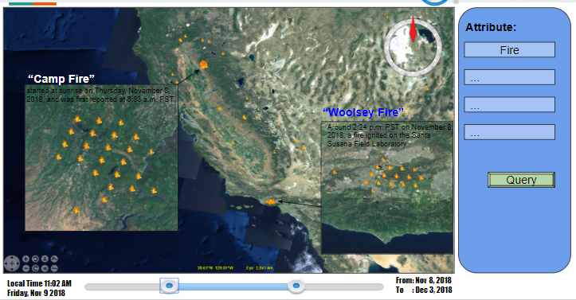

# Tutorials
## Active Fire Detection
The following tutorial will demonstrate how to run an existing docker Image that seamlessly detects fire events across the United States using GOES satellite data.

1. Go to a deployed GeoNEX website, for example: `http://13.57.231.201:8080`
2. Enter __XXXX__ for both Username and password and click __login__
	* The dashboard page should become visible, this is where you control running Images and access their output among other things.
 
3. On the left menu, click on the __GeoNEX Containers__ tab
4. Under the __Action__ column, click __Action__ then __Run__ for the row with the following Image:
	* _geonex/active_fire_go16abi15_
	* This will lead you to a new page for selecting the Container name (Running Image name) configurations. 
5. Make sure the following is entered:
	* Runner Name: My Fire Detection 
	* Instance type: _m5d.4xlarge_
	* Running type: real-time runner
	* Data Source: GOES16
	* Docker Command Line: `docker run --rm geonex/active_fire_go16abi15:1.5 -s 20183112017182 -r RadC -u s3://geonex-yunfeng/GO16_ABI15_DEMO`
6. Click __Run Docker__
	* This will launch the Image as a docker container in a new AWS instance and will take you to the __Real-time runner__ page (which is also accessible from the left-menu), where you can see the status of all Images previously run.
	* If all goes well during that process the __status__ column should eventually show __running__
	* Every time the real-time container you just run executes, it creates a timestamped task entry.
7. To view the tasks executed by the running container __My Fire Detection__: under the __Action__ tab, click __Action__, then __Tasks__. 
	* All tasks run in the same instance designated by the instance-id column.
8. Once the __state__ column of the tasks generated show __finished__, you can select ________Action______ then ____Outputs__ to see the outputs. Each task should take less than 5 minutes to complete.
9. This Image generates 4 output files:
	* _.json_ file that contains: Fire events coordinates and their properties (temperature..) in geojson format
	* _.log_ file: Detailing a timestamped task log 
	* _.nc_ file: Raw output of fire detection script (fire mask map in netcdf format)
	* _.png_ file: A visual output showing a map with overlaid fire data.
10. As long as the container is running, these tasks will be executed as soon as GOES maps are available. 
	* __WARNING__: Make sure to stop the container once you no longer need real-time outputs to save on costs. 
11. A sample display of the output is shown below:
