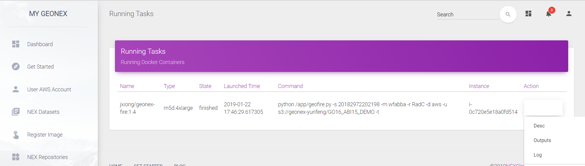

## Getting Started 

This article will guide you through your first steps in GeoNEX dashbard. You'll be working with some sample data from [GOES16](https://registry.opendata.aws/noaa-goes/). You'll see examples of a wildfire real-time detection using GeoNEX.

In Part 1, you'll learn how to:

- submit an algorithm
- request a cloud runner 
- retrieve geostationary data from AWS S3 bucket
- check the outputs of algorithm as well as the runtime log

In Part 2, you'll learn how to:

- create visualization & analytics code for your outputs
- run the code in the notebook
- share your results with others

### Registering a docker Image

*Registering an image from docker hub*

The docker image can be directly downloaded from the public docker hub without any required permissions. When registering the docker image, the user has to input the image’s source, description, user name, email, and user’s organization. Once you register the image, the image can be found in NEX Repositories as shown below:

*List of registered images in GeoNEX repositories*

For each image, user can execute “Run” action. If the image has not been downloaded in current running instances, INSTANCE label will show as “null”. User can select the instance type they would like, customize the command line to run, and output like Amazon S3 bucket.

Once running docker image, user can find the launched tasks in Cloud Task list, each task display some details include image names, instance type, status, launched time, command, and instance id.

### Removing an GeoNEX Image
To remove a GEONEX image, simply click on the drop down menu under the ACTION tab and then click Remove. This is illustrated in the image below.

*Removing an Image*

### Requesting admin Image approval
To request approval for an image, simply click on the drop down menu under the ACTION tab and then click Request. This is illustrated in the image below.

*Requesting Admin approval*

### Approving an Image (Admin)
To approve an image, you first need to be logged in as an Administrator. Then, simply click on the drop down menu under the ACTION tab and then click Approve. This is illustrated in the image below.

*Use admin to login, and click approve button*

### Running an Image on GeoNEX
To run an image, simply click on the drop down menu under the ACTION tab and then click Run. This is illustrated in the image below.

*Select Run Action*

*Run Image Settings*

A user can run one or multiple images by clicking on their respective “Run” ACTION button. If the image has not been downloaded in the current running instances, the INSTANCE label will show “null”. The user can select the instance type they want, customize the command line to run, and specify the output in Amazon S3 bucket format.

### Monitoring running tasks

*Viewing running tasks*

To view running tasks, click on the Cloud Tasks tab in the left Dashboard menu. The Running Tasks page will appear listing all the currently running docker images. Each running task entry displays some details including image name, instance type, status, launched time, command, and instance id.

### Task output & log file
First make sure you are viewing the Running Tasks page, then locate the desired task, and finally simply click on the drop down menu under the ACTION tab and click Outputs or Log. This is illustrated in the image below.

*Checking running task Log/Output*

*Container Outputs Page*

After selecting a running task’s “Outputs” ACTION, the user can view all outputs from that task.
After selecting the “Log” ACTION, the user can download the log file of that task.

### Monitoring EC2 instances

*Running EC2 instances*

Click on the EC2 Instances tab in the left Dashboard menu. The user can then view all running EC2 instances created by the AWS account. The user can further start, stop, or terminate the instances.

### Licensing [TODO]